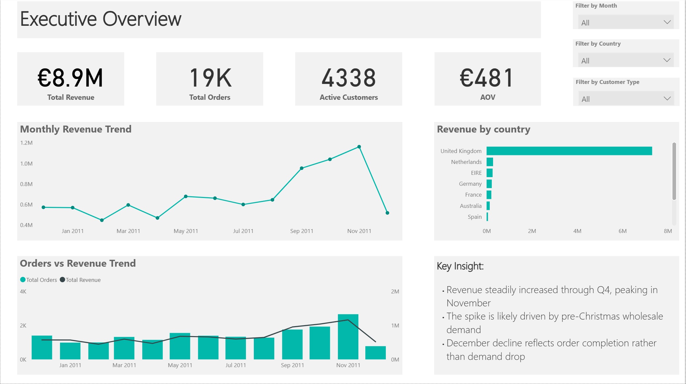
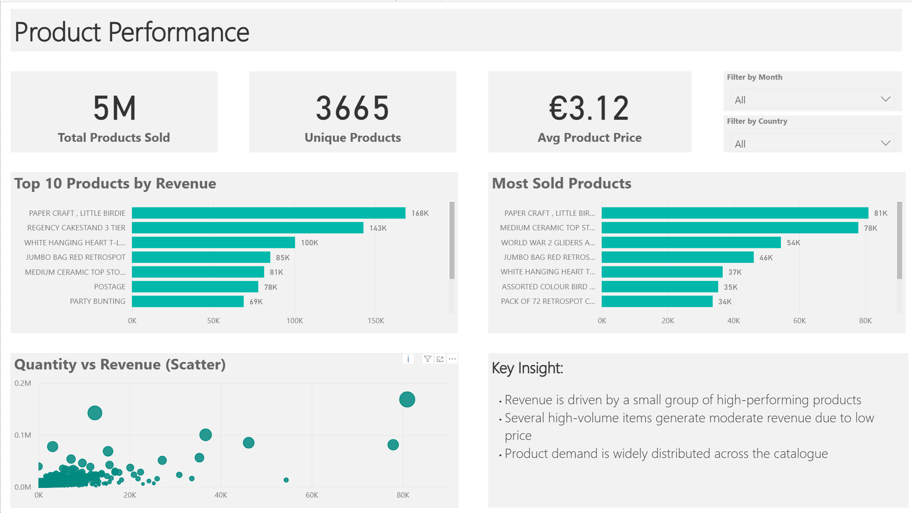
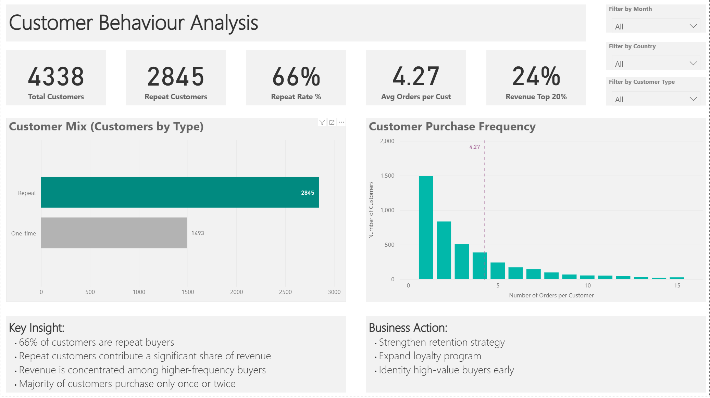
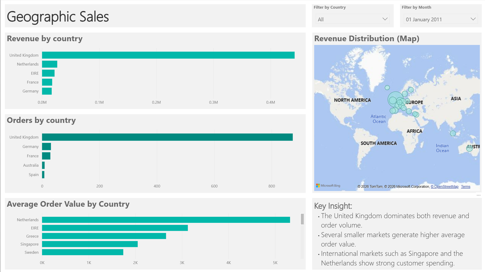

# UK Online Retail Sales Analysis

This project analyses UK online retail sales data using **SQL and Power BI**.

## Dataset

The dataset used in this project is the **Ecommerce Data dataset** available on Kaggle.

Source:
https://www.kaggle.com/datasets/carrie1/ecommerce-data

The dataset contains transactional data for a UK-based online retail store between **December 2010 and December 2011**, including:

- Invoice number
- Stock Code
- Product description
- Quantity
- Invoice Date
- Unit price
- Customer ID
- Country

Due to file size limitations, the dataset is not included in this repository.  
You can download it directly from the Kaggle source above.

## Tools
- PostgreSQL
- SQL
- Power BI

## Key Metrics
- Total Revenue: €8.9M
- Total Orders: 18,532
- Active Customers: 4,338
- Average Order Value: €480

## Dashboards
## Executive Overview

## Product Performance

## Customer Behaviour

## Geographic Sales

## Report
See full report in:
`retail_sales_analysis_professional_report.docx`

## SQL Queries
`retail_analysis_queries.sql`

---

## 👤 Author

**Ilham Oussanna** — Junior Data Analyst   
🔗 [LinkedIn](https://www.linkedin.com/in/ilham-o-89372a274)

